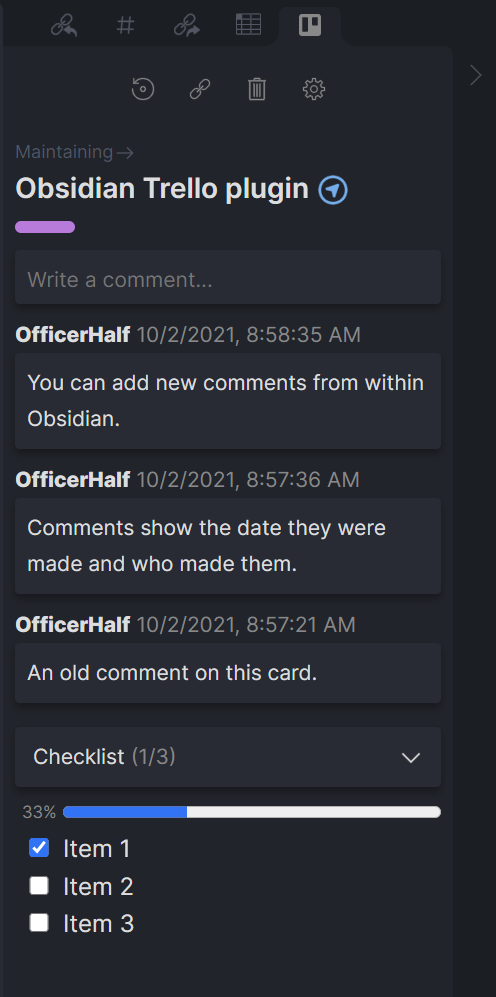
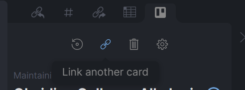
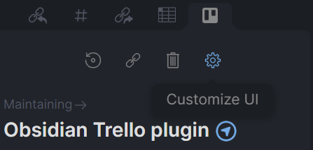

# Obsidian Trello

## Overview

Connect your Trello cards with your Obsidian notes to see and update labels, comments, and checklists from within Obsidian. There are plenty of features on the horizon and you can [track progress on the Trello board](https://trello.com/b/1fVRPLKO/obsidian-trello) for the project.

## Use

Once installed and set up with a Trello API token (see [prerequisites](#prerequisites) below) you can connect a card to a note.

#### Open the Trello Pane

If the Trello pane is not automatically opened, use the [Show Trello view command](#commands) and it will be created.

#### Connecting Cards

To connect a card to a note either use the [Connect Trello card command](#commands) or click the 'Connect Trello Card' button in the Trello Pane. If a card is already connected, there is a button to link a different card instead.

**Creating new cards**

When connecting a card, after selecting the Trello board you want to use, select 'Create a new card...'.

#### Refreshing Cards

The plugin does not poll or listen for updates from Trello, so changes made in Trello may not be immediately reflected in Obsidian. If you believe a card is out of date, click the refresh button. Data is cached for anywhere from one minute to ten minutes depending on the type of data. If you wish to forcibly refresh the entire cache, you can use the 'Reload app without saving' command.

Do be mindful that Trello's REST API has strict rate limits. If you run into any rate limiting issues please contact me so I can work on a fix.

#### Disconnecting Cards

If want to remove the connection between a note and Trello card, click the 'Unlink card' button or use the [Disconnect Trello card command](#commands). Removing the `trello_plugin_note_id` and `trello_board_card_id` YAML frontmatter keys will also unlink the card, but prefer the button or command as they cleans up cached data as well.

#### Moving cards between lists

A card can be moved to a new list by clicking on the list name.

#### Adding comments

New comments can be added from within Obsidian. It will appear at the top of the list as the most recent comment.

#### Checklists

Checking or unchecking an item in a checklist makes the corresponding change on the Trello card.

#### Customizing UI

If your workflow doesn't include comments or labels, for example, you can disable them in obsidian. Each UI element can be toggled on or off. This can be global, for all connected cards, using the 'Customize UI' option in plugin settings. Or, this can be managed for an individual note using the gear icon.

## Setup

### Prerequisites

1. A Trello account
2. The [MetaEdit](https://github.com/chhoumann/MetaEdit) Obsidian plugin (install from inside Obsidian)
   - Obsidian Trello makes use of MetaEdit's [YAML Frontmatter API](https://github.com/chhoumann/MetaEdit#api).
3. A Trello API token (see below).

Before you can connect a Trello card, you need to create an API token and set it in the plugin settings. You can create a token [here][tokenurl]; make sure to copy it before closing the tab.

Tokens can be revoked at any time in your Trello account settings.

### Settings

**Trello Token** - See the prerequisites above. This is required.

**Customize UI** - Adjust which parts of a card are displayed. This setting can be updated globally, which applies to all cards, and overridden on an individual note.

**Select Boards** - Filter the boards available to select cards from. If none are selected, all boards will be available.

**Open to Side** - Whether to open the Trello view to the left or right by default.

**New Card Position** - Whether newly created cards should be added to the top or bottom of the list by default. Can be overridden when adding a card.

**Moved Card Position** - When moving a card from one list to another, should it be moved to the top or bottom of the selected list.

**Verbose Logging** - Enable this if you're having trouble with the plugin. Logs will be enabled in the console. These can help me diagnose issues.

## Commands

**Show Trello view** - Open the Trello pane, if it isn't already.

**Connect Trello card** - Connect a note to a (new) Trello card. Optionally, create a new Trello card.

**Disconnect Trello card** - Remove the Trello connection from a note.

## Theming

Wherever possible, the plugin uses built-in theme variables, so your color variable overrides will apply here. The exception is the trello colors included in the plugin; these match the colors from Trello's UI. However, these can be overridden the same as Obsidian's color variables. See [variables.scss](src/variables.scss) for the full listing of colors. Each has a base shade, lighter shade, and darker shade.

## Contributing

Pull requests are always welcome. Keep in mind that this plugin makes heavy use of [rxjs](https://www.learnrxjs.io/) for reactive state management.

## Support

Raise an issue here on GitHub if there's a problem. If you're unsure, feel free to contact me on the Obsidian discord, @OfficerHalf.

[tokenurl]: https://trello.com/1/authorize?expiration=never&scope=read,write&response_type=token&name=Obsidian%20Trello%20Token&key=9537467993aefd6dca9ee7788179c298
